# Smart Response XE & CC1101 

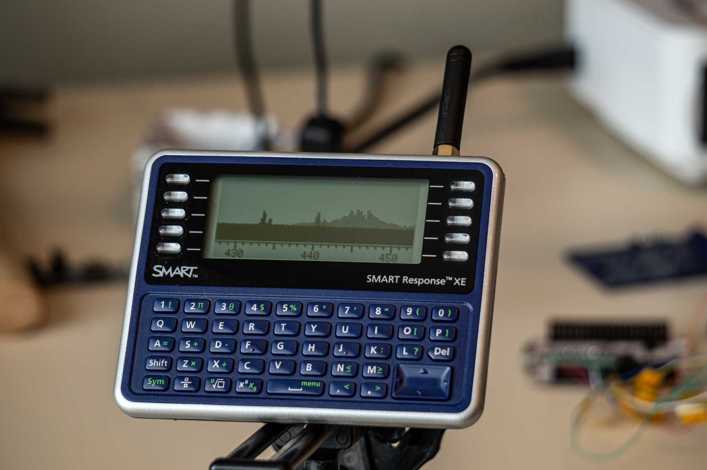

This project repurposes the Smart Response XE device for digital radio trickery by adding a CC1101 module to it. 
Initial application is a proof of concept DAPNET pager receiver. Currently in very early stage that can only properly receive short frames.

Additionally, there is a spectrum analyzer application showcased in above photo.  


## Smart Response XE 

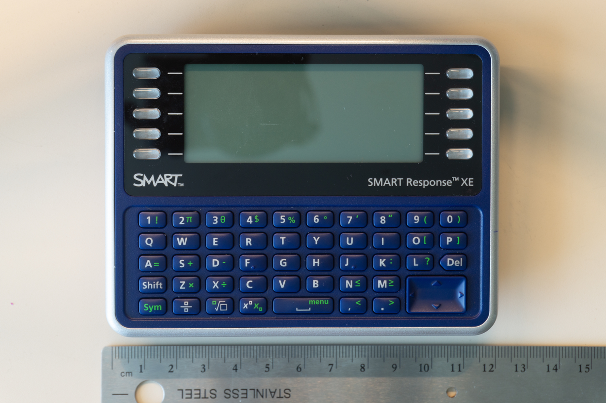


This little device used to serve as a classroom digital aid. Teachers would make tests and students would answer questions on these. Luckily for everybody, the popularity seems to have died and these can now be found on eBay for a few bucks a piece. 

What's more interesting, an Arduboy forum member, is0-mick took a closer look (https://community.arduboy.com/t/smart-response-xe-re-purposed-into-arduboy/6094) at one of these and discovered that at its core is an ATmega128RFA microcontroller. In other words, it's an Arduino compatible device that also has a built in 2.4GHz transceiver. Oh, it also has a full QWERTY keyboard and a display! 
There have been a couple of projects that flash more interesting firmware to these devices that make it into an arduboy or an zigbee sniffer. 

I, however, wanted to play with different digital radio modes. You see, this blue case is pretty big, and can easily fit additional stuff inside. It reminded me of pink pagers brandished by the Michel Ossmann and Travis Goodspeed years ago. 


## CC1101 Transceiver 

CC1101 is a sub-1GHz transceiver IC that can be configured to transmit and receive a number of digital radio protocols. Now days , you can find it built into an msp430 microcontroller where it goes by the name of CC430 and is used in things like Goodwatch. 

I've been tinkering with Travis' Goodwatch from time to time and thought a device with full keyboard and a display would be a nice complement to Goodwatch's radio apps. 

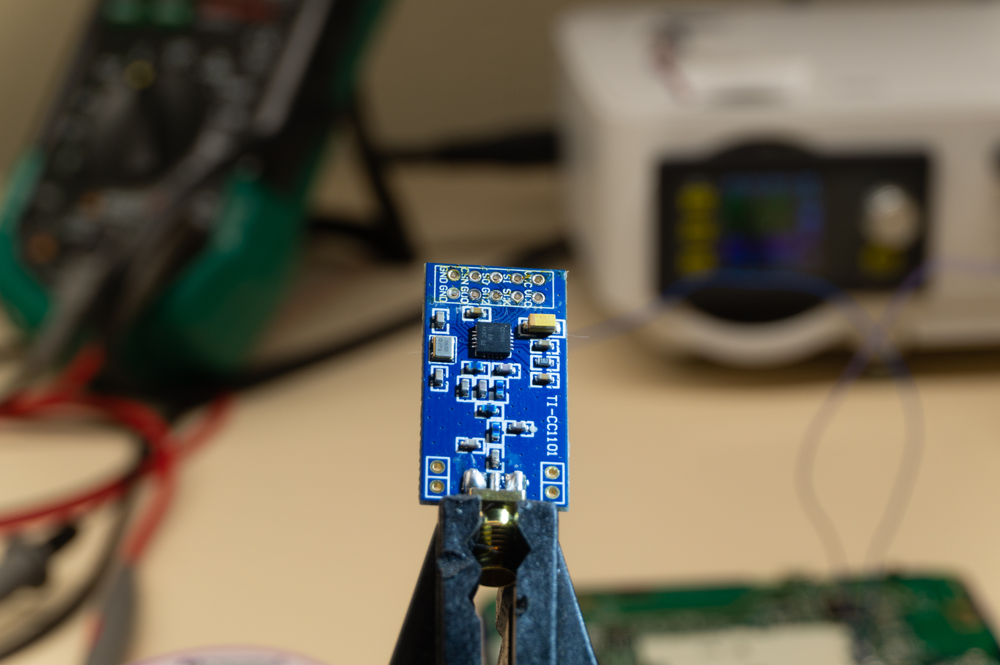

One of these things is about 3.50 on eBay , with an antenna! We are going to fit it inside the SRXE. 

## Preparing the SRXE

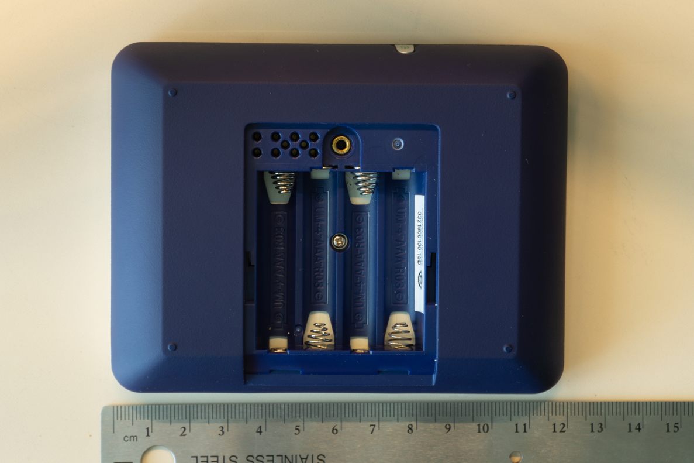

If you just want to use SRXE as is but with custom firmware, you are in luck, as it happily exposes SPI test pads on the back above batteries and Joe Fitzpatrick has already designed a pogo-pin board that breaks those out (https://github.com/securelyfitz/smartresponse). 

Since we want to add a CC1101 module to the inside, we'll have to open it up, and while we are at it, we might as well flash a user friendly boot loader and break out UART for future programming. 

To do so, you first remove a single screw in the battery compartment and then the gray bezel which hides a couple of spokes.

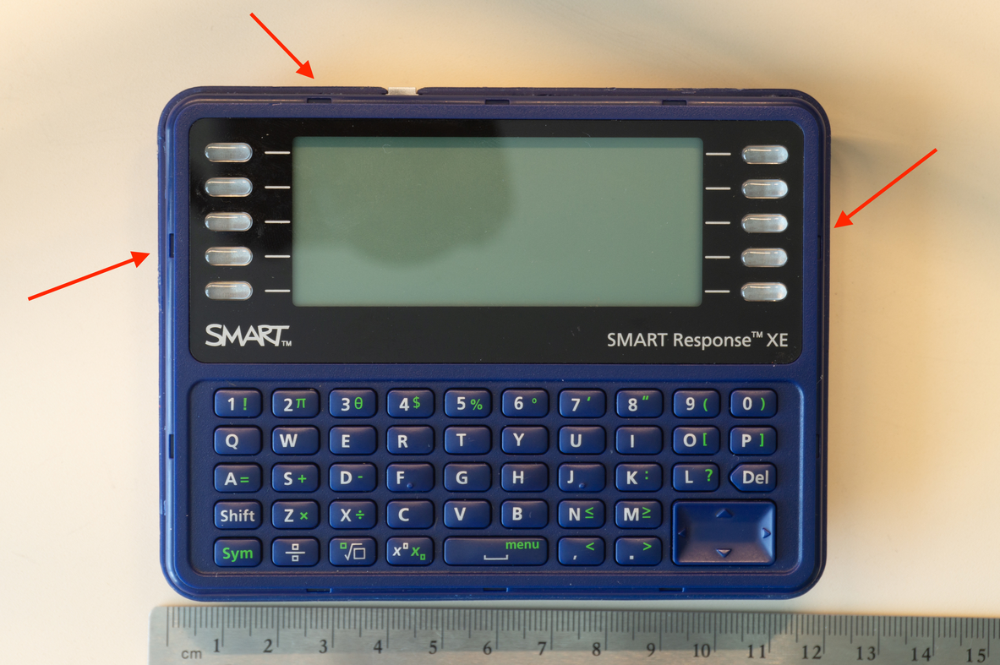


Then, you can pry apart the two parts of the case, being careful not to lose the damn power button. 

Opening the case reveals the back side of the board which contains all the important parts. 

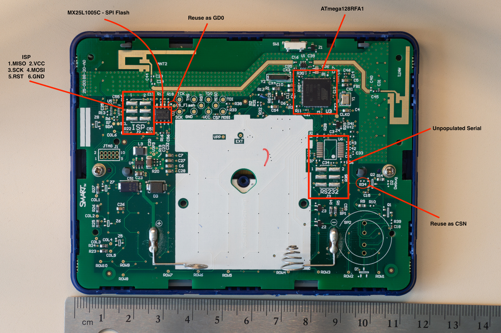

We'll refer to this photo again.

First, you'll notice a nice ISP breakout. We'll need to connect these to an ISP programmer in order to burn the boot loader. Larry Bank has already made a nice (and not so little) bootloader for us to use that will let us upload future code over serial so we don't have to deal with ISP again. Get it here https://github.com/bitbank2/SMART_bootloader, it has a prebuilt hex file already. 

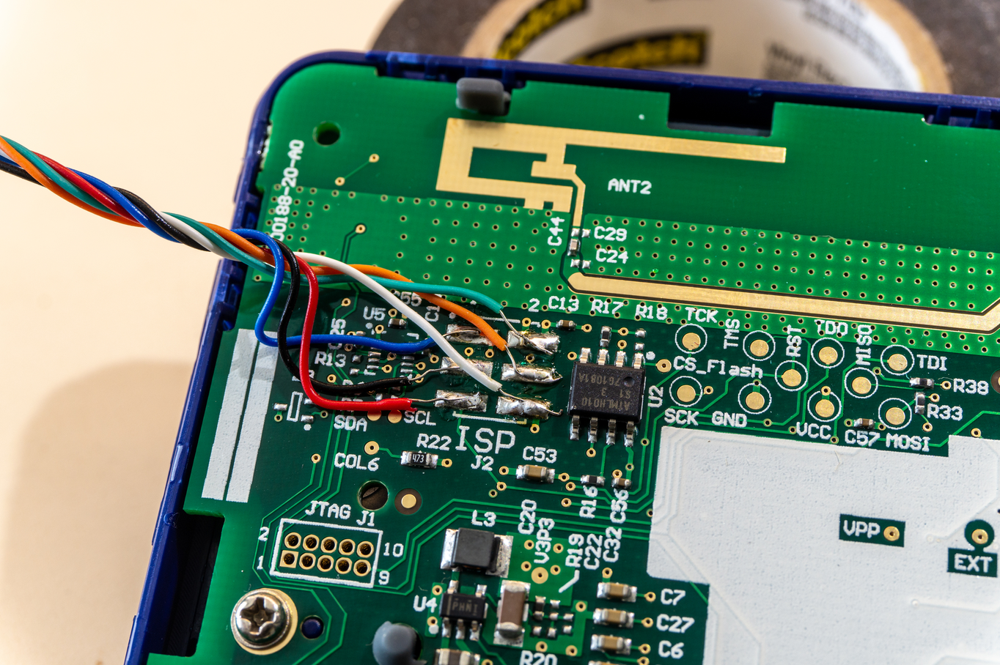

Since these ISP connections are only temporary , I wasn't too worried about solder joints quality. To actually program the boot loader, you'll need one of these:

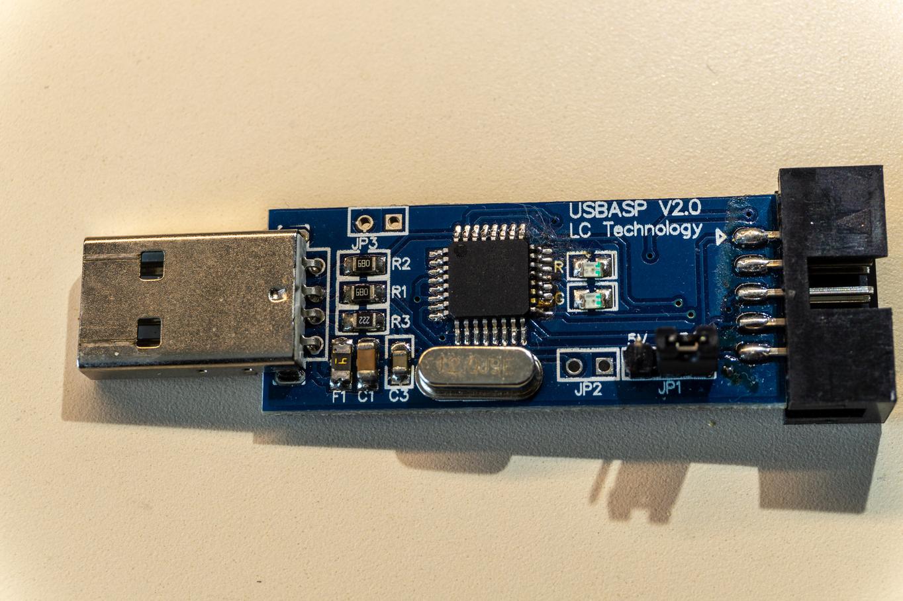

You can also get away with using any random arduino board you have laying around (search for arduino ISP guide).

Nice thing about Larry's bootloader  is that it gives us 3 ways of flashing firmware to the SRXE. Over either of the two existing serial interfaces or over wireless! There's quite a bit of code involved in doing it wirelessly, which takes away from space available to the rest of the code, so at some point we might want to slim down the bootloader and keep only the serial way if needed. In order to utilize wireless flashing method, you'll need to sacrifice another SRXE device to serve as a master. I chose to go with the simpler option, reusing the serial0 interface as it's fairly easy to access. 

To actually burn the bootloader, after connecting the ASPUSB to the appropriate pins on the ISP breakout pads, you'd issue two commands:
```
/bin/avrdude -C/etc/avrdude.conf -v -patmega128rfa1 -cusbasp -Pusb -e -Ulock:w:0x3F:m -Uefuse:w:0xF5:m -Uhfuse:w:0xD8:m -Ulfuse:w:0xFF:m

/bin/avrdude -C/etc/avrdude.conf -v -patmega128rfa1 -cusbasp -Pusb -Uflash:w:./SMART_bootloader/ATmegaBOOT_atmega128rfa1.hex:i -Ulock:w:0x0F:m
```
First one sets the appropriate fuses and second one writes the bootloader. If all went well, when you power up the board, you'll be greeted by Larry's SRXE Bootloader.


Next step is to get access to secial TX and RX lines. On the right hand side of the board, there is an unpopulated footprint for a 16 pin IC. This is likely for a max232 or the likes. Since we are ok with 3.3V level serial, we can just bridge a couple pins and get out TX and RX lines out. Following photo shows the necessary modifications:

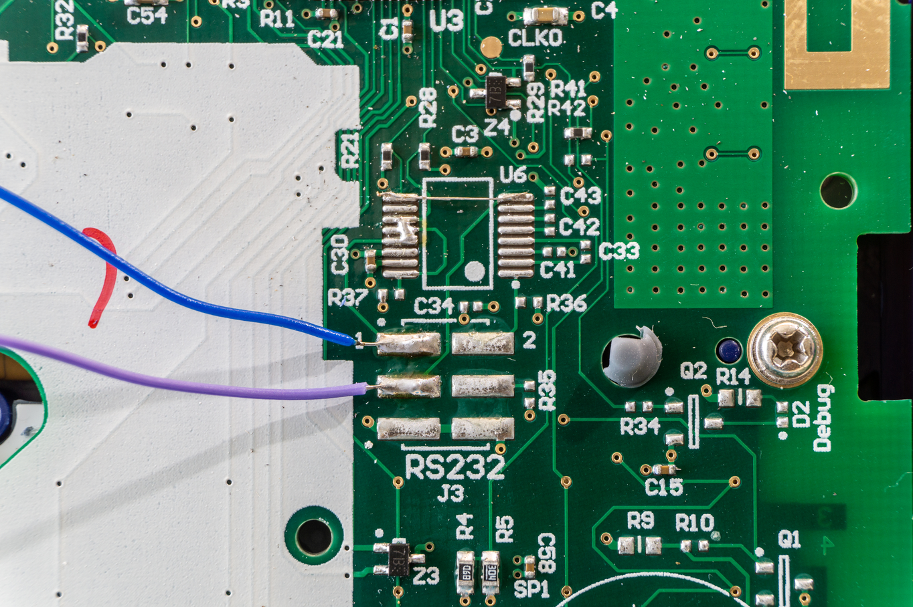

First, you need to bridge the two topmost pads, and then bridge the pads 3,4 and 5. After this, pads 1 and 3 are RX and TX respectively. We'll want access to those when the device is assembled, so solder 2 wires of about 10cm to these. These will be routed out through the battery compartment and can be easily attached to an usb2uart adapter (GND and Vcc can easily be accessed via battery terminals). 
You'll want to confirm that this serial connection is indeed working before reassembling the case.

## Adding a CC1101 module


CC1101 module that we are going to use is a SPI device which requires at least 7 pins to control. Lucky for us, MISO, MOSI, SCK , VCC & GND pins are obviously accessible via those pads intended for POGO pins that we already mentioned , on the top of the board. If you want to leave those pads intact, you can reuse the ISP pads. All that's left is GD0 and CSN pins. If we take a closer look at the Atmega128RF datasheet , and trace the PCB traces around the board a bit, we can see that CSN pin from ATMega128 , or pin 36, seems to be unused and is most easily accessible via unpopulated resistor pad on the right hand side of the board. As GD0 interrupt pin, we can reuse the pad marked as CS_flash which is connected to pin 1 of the SPI flash IC. Refer to the full board photo above for details. 

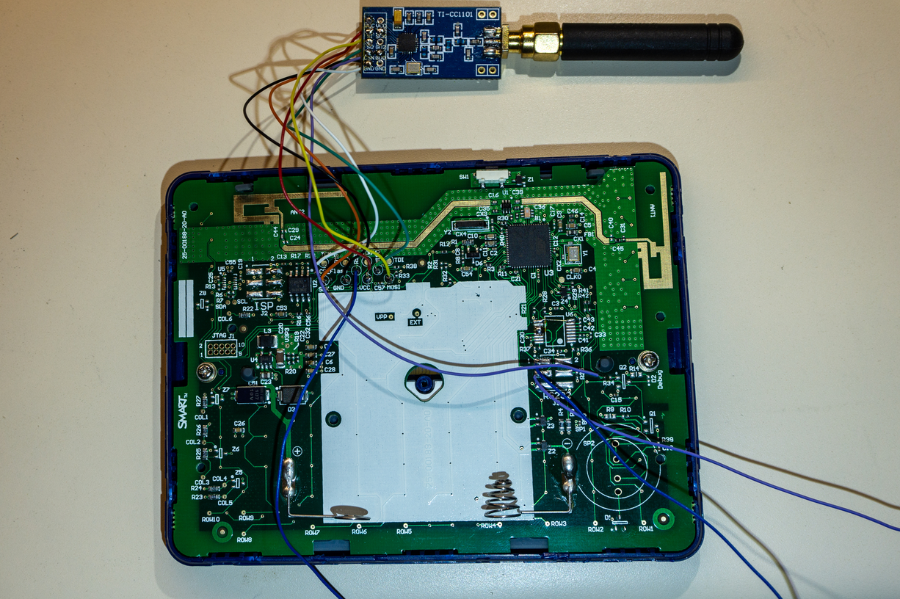

This is what we get after connecting all the required pins. While we are at it, we might as add a wire to RST pad , which will come in handy while developing code as we'll inevitably get stuck. To reboot the device, simply touch this wire to ground. 


## Mechanical modifications

In order for the full CC1101 module to fit inside the case, and not look suspicious, we'll need to drill one hole for the antenna SMA connector, and make a small adjustment to fit the module PCB (alternatively, you can likely fit both the antenna and the module inside the case). I drilled one 1/4" hole on opposite side of the power button. I also cut a bit of plastic reinforcement below it to fit the module snugly. 

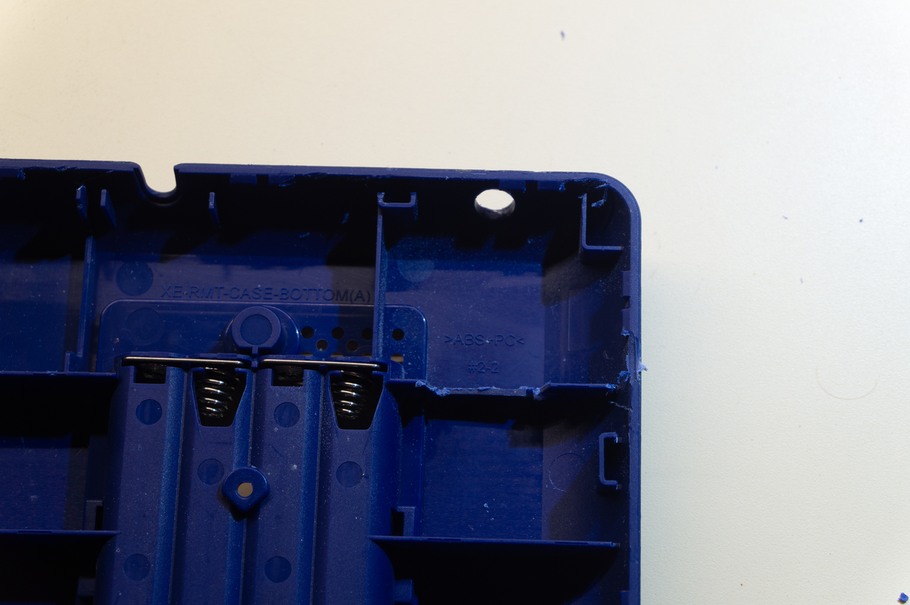

Due to SMA connector size, you'll want to orient the board like this:

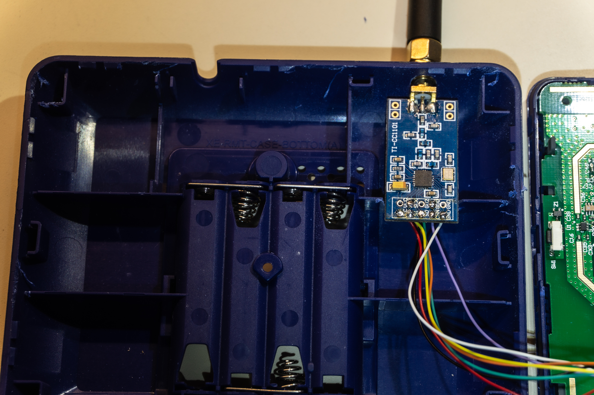


And that's it! Pack it all together, snap the spokes and put the bezel back. It's as good as new.


Now on to firmware. 


## Firmware


Currently , this project comes in a form of an Arduino sketch, which has it's limitations, but simplifies other things. You install it as any other arduino sketch via serial interface (serial0 if you use the serial port as described above). 

Compiled binaries (hex files actually) are provided in `bin` directory.

The sketch has two external and two internal dependencies. ~First , you will need the nice support library from BitBank2 ( https://github.com/bitbank2/SmartResponseXE )~. First , install a nice SRXE support library from BitBank2 (my fork adds a couple of functions that simplify drawing thigs https://github.com/ea/SmartResponseXE). That adds easy display manipulation and so on. Then, you will need to install a proper board definition. SRXE board is technically compatible with Sparkfun's AtMega128RFA1 dev board (https://learn.sparkfun.com/tutorials/atmega128rfa1-dev-board-hookup-guide/all ) , ~so you just need to follow their guide to install this board definition into your Arduino IDE~. Old sparkfun board definitions seem to be quite stale, but PDXBadgers have an updated, patched version here (along with some other fun SRXE sketches): https://github.com/pdxbadgers/5ohBEE-2019 . 


Both current sketches rely on a separate CC1101 driver library which was based on https://github.com/simonmonk/CC1101_arduino but modified to suit my needs better. It can be found here: https://github.com/ea/CC1101.  I had to modify a few bits an pieces so it's easier to just separate the code. The pocsag sketch uses a pocsag decoder which is borrowed from Travis' Goodwatch repo. Spectrum analyzer code was ported from IM-me specan: https://github.com/mossmann/im-me/tree/master/specan


